<div align="center">

  # 👟 SneakerStore
  ### Premium E-Commerce Platform for Footwear & Apparel

  [](https://react.dev/)
  [](https://laravel.com/)
  [](https://www.php.net/)
  []()
  [](LICENSE)

  **A full-stack, modern e-commerce application built with React 19 and Laravel 12 API.**

  [Explore Features](#-key-features) • [Screenshots](#-screenshots-showcase) • [UML Diagrams](#-system-architecture--uml) • [Installation](#-getting-started)

</div>

---

## 📌 Overview

**SneakerStore** is an enterprise-grade e-commerce web application engineered for high-performance footwear sales. It combines a dynamic, responsive user interface powered by React 19 with a robust, RESTful API backend built on the Laravel 12 framework.

The platform provides a seamless shopping experience for customers—including interactive product catalog filtering, real-time cart drawer, order tracking, and account management—alongside a comprehensive Administrative Dashboard for inventory management, sales analytics, and order fulfillment.

---

## ✨ Key Features

### 🛒 Customer Storefront
- **Dynamic Homepage & Catalog:** Hero banners, trending products, curated collections (Men's, Women's, Kids'), and responsive filtering by brand, size, price, and color.
- **Product Details Page:** Multi-image product gallery, size selection, stock status, product specs, and customer reviews.
- **Real-Time Cart Drawer:** Interactive slide-out cart drawer with live subtotal calculation and item manipulation.
- **Seamless Checkout:** Multi-step checkout with address validation and order summary.
- **Order Tracking:** Real-time order status updates and order history for registered users.
- **User Authentication:** Secure Sanctum-powered authentication (Login, Register, Password Reset).

### 🛡️ Admin Dashboard & Analytics
- **Analytics Overview:** Interactive metrics powered by Recharts (total revenue, daily sales, order velocity, top-selling products).
- **Product Management:** Full CRUD operations for products (image upload, pricing, stock levels, categories, variants).
- **Order Fulfillment:** Comprehensive order management table with status updating (Pending, Processing, Shipped, Delivered).
- **Customer Directory:** Manage registered users and customer order histories.

---

## 🖼️ Screenshots Showcase

### 🌐 Customer Storefront

| Hero Banner & Featured | Product Catalog |
| :---: | :---: |
| 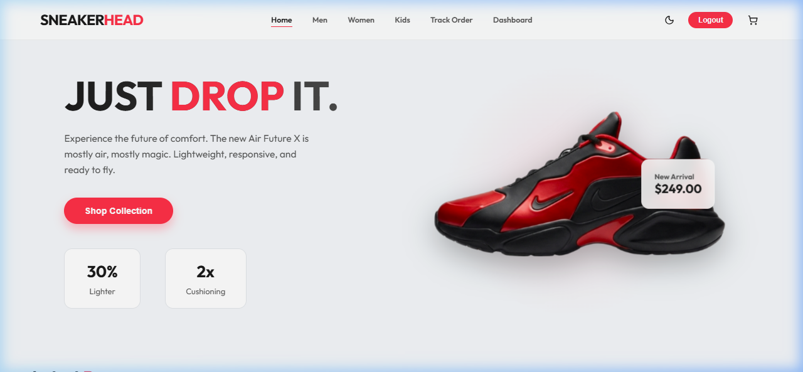 | 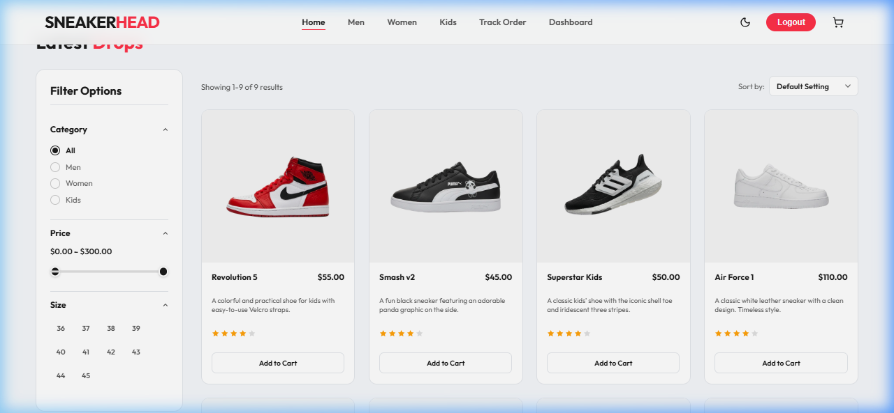 |

| Product Detail View | Interactive Cart Drawer |
| :---: | :---: |
| 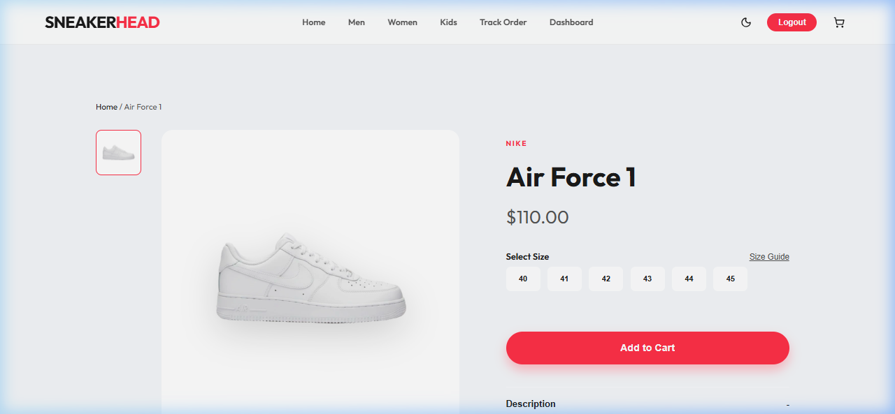 | 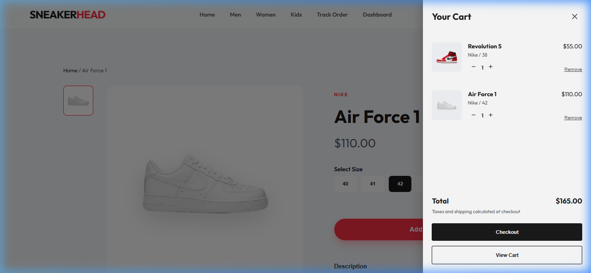 |

| Checkout Page | Order Tracking |
| :---: | :---: |
| 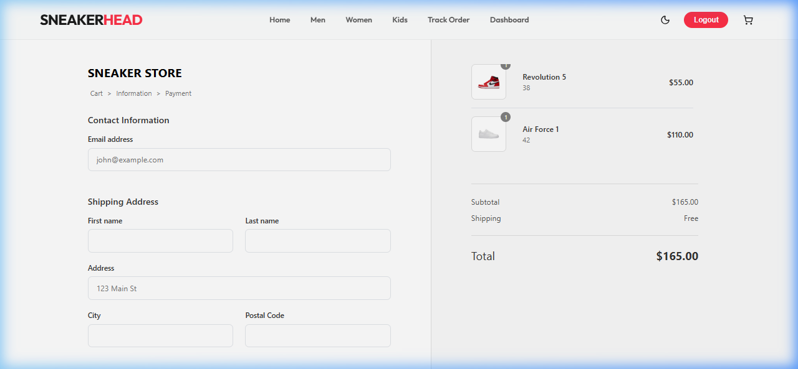 | 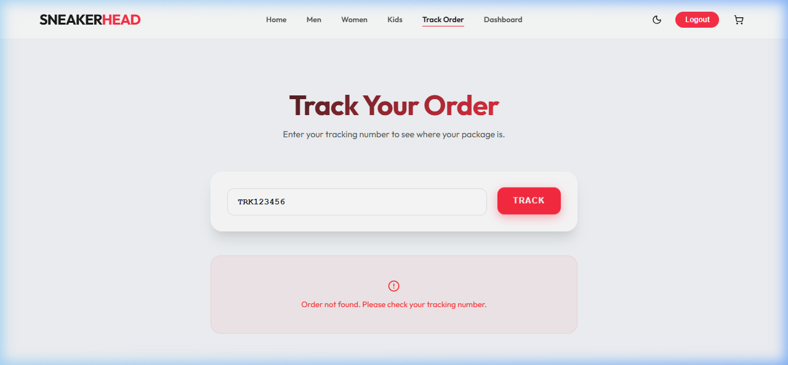 |

| Men's Collection | Women's Collection | Kids' Collection |
| :---: | :---: | :---: |
| 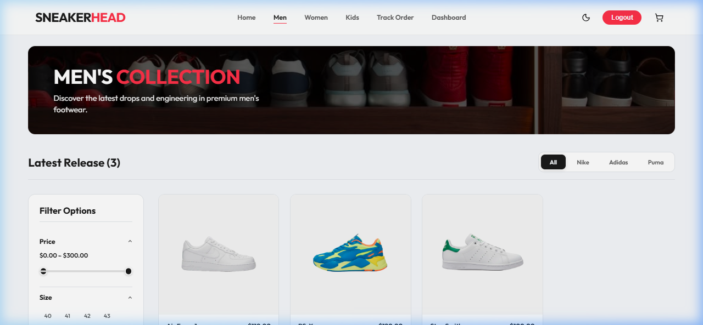 | 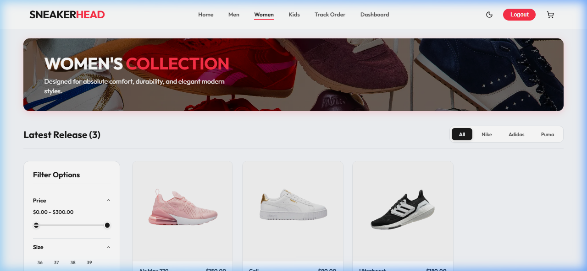 | 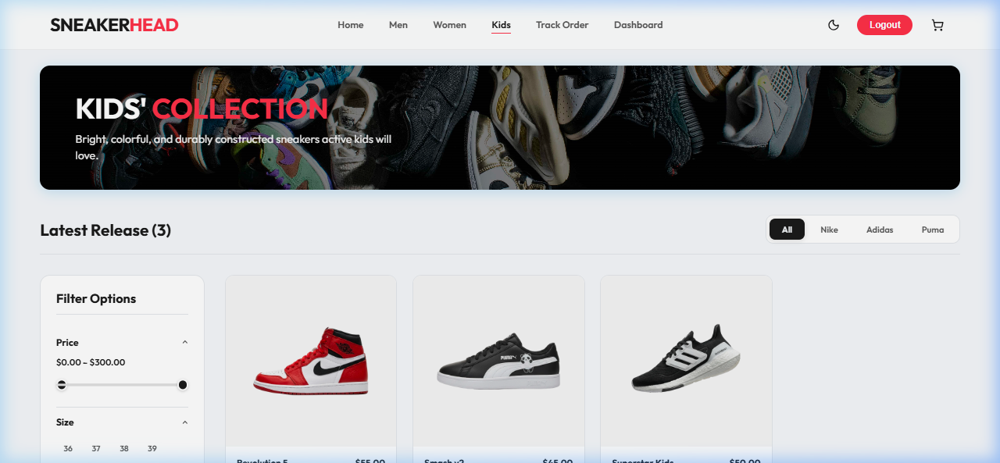 |

---

### 📊 Admin Control Center

| Admin Dashboard Analytics | Product Management |
| :---: | :---: |
| 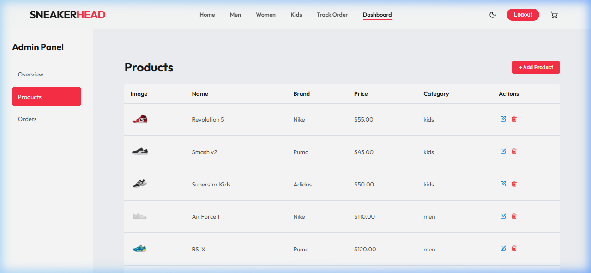 | 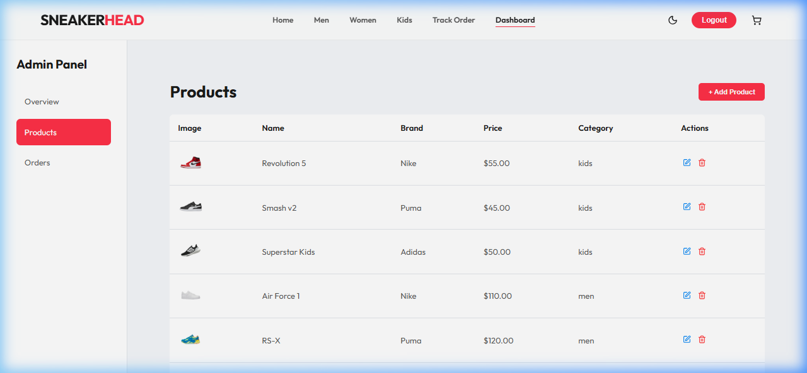 |

| Add / Edit Product | Order Management |
| :---: | :---: |
| 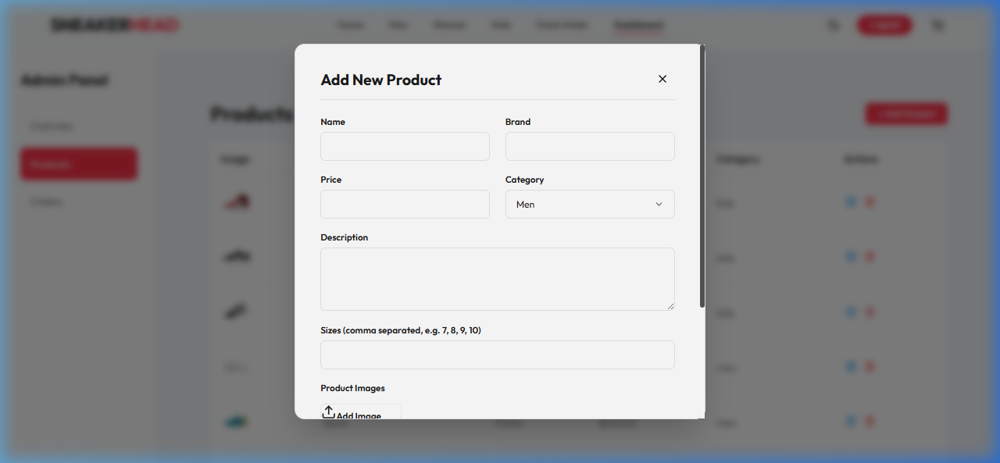 | 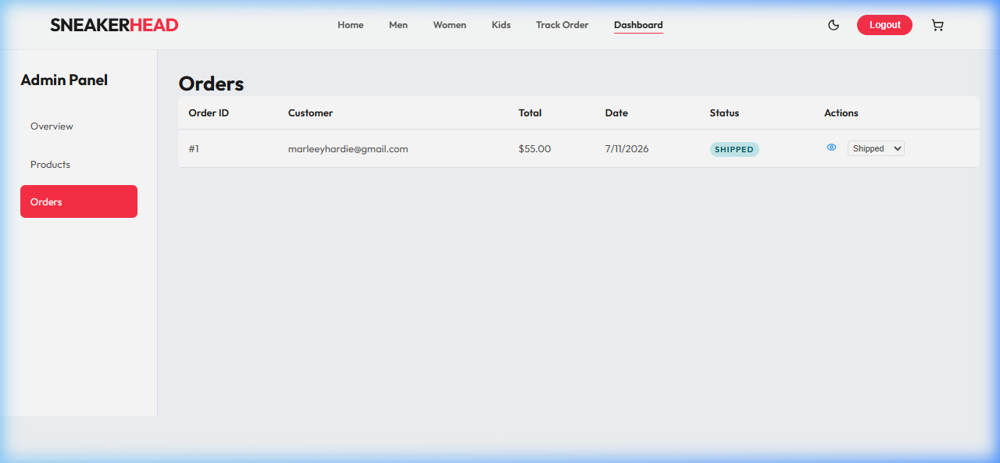 |

---

## 📐 System Architecture & UML

### 🔹 Use Case Diagram
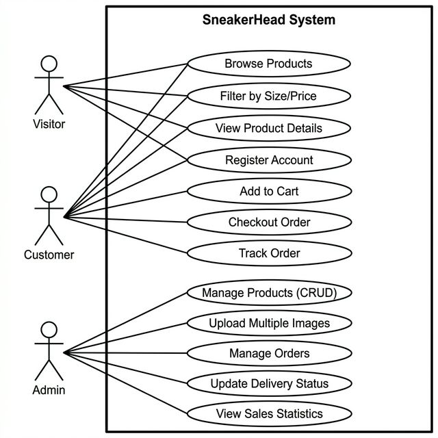

### 🔹 Sequence Diagram
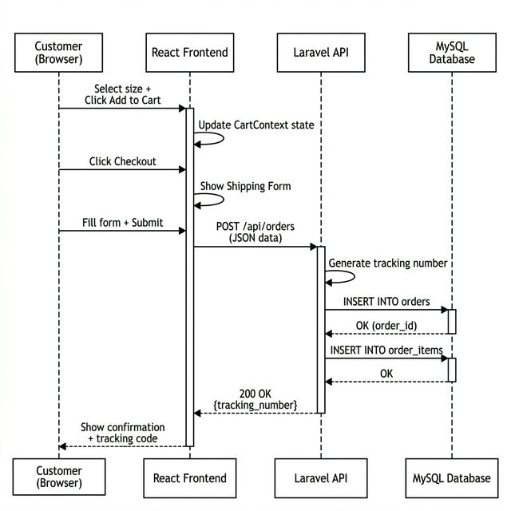

### 🔹 Class Diagram
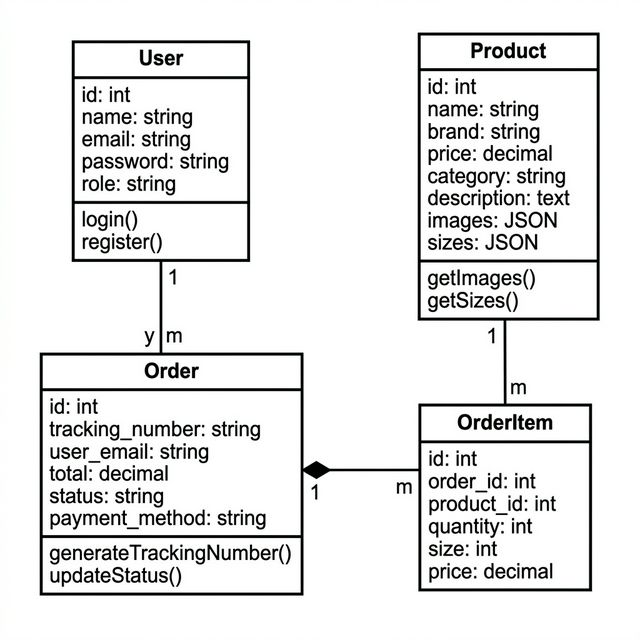

---

## 🛠️ Tech Stack

### **Frontend**
- **Framework:** React 19 (SPA architecture)
- **Routing:** React Router v7
- **Icons:** Lucide React
- **Data Visualization:** Recharts
- **Styling:** Custom Modular CSS with CSS Variables & Glassmorphism design tokens

### **Backend**
- **Framework:** Laravel 12 API
- **Language:** PHP 8.2+
- **Authentication:** Laravel Sanctum
- **Database:** MySQL / SQLite
- **ORM:** Eloquent ORM

---

## 🚀 Getting Started

Follow these steps to set up and run SneakerStore locally.

### 📋 Prerequisites
- **PHP** >= 8.2 & Composer
- **Node.js** >= 18.x & npm
- **MySQL** or **SQLite**

---

### ⚙️ Backend Setup (`/backend`)

1. **Navigate to the backend directory:**
   ```bash
   cd backend
   ```

2. **Install PHP dependencies:**
   ```bash
   composer install
   ```

3. **Configure Environment:**
   ```bash
   cp .env.example .env
   php artisan key:generate
   ```

4. **Set up Database & Run Migrations:**
   Ensure database parameters are set in `.env`, then execute:
   ```bash
   php artisan migrate --seed
   ```

5. **Start Laravel API Server:**
   ```bash
   php artisan serve
   ```
   *Backend API will run at `http://127.0.0.1:8000`*

---

### 🎨 Frontend Setup (`/frontend`)

1. **Navigate to the frontend directory:**
   ```bash
   cd frontend
   ```

2. **Install NPM dependencies:**
   ```bash
   npm install
   ```

3. **Start React Development Server:**
   ```bash
   npm start
   ```
   *Frontend application will open at `http://localhost:3000`*

---

## 📁 Repository Structure

```
SneakerStoreV1/
├── backend/                  # Laravel 12 REST API
│   ├── app/                  # Models, Controllers, Middleware
│   ├── config/               # Application & Auth configurations
│   ├── database/             # Migrations, Factories, Seeders
│   ├── routes/               # API routes (`api.php`)
│   └── storage/              # File storage & uploads
│
├── frontend/                 # React 19 Single Page Application
│   ├── public/               # Static web assets
│   ├── src/
│   │   ├── components/       # Reusable UI Components
│   │   ├── pages/            # Page Views (Home, Catalog, Admin, etc.)
│   │   ├── styles/           # CSS Modules & Stylesheets
│   │   └── utils/            # API helpers & storage management
│   └── screenshots/          # System design diagrams & UI screenshots
│
└── README.md                 # Project Documentation
```

---

## 👤 Author

**Yahya Allouz**
- **GitHub:** [@yahyaallouz](https://github.com/yahyaallouz)
- **Email:** yahyaallouz01@gmail.com

---

<div align="center">
  <sub>Built with ❤️ by Yahya Allouz</sub>
</div>
